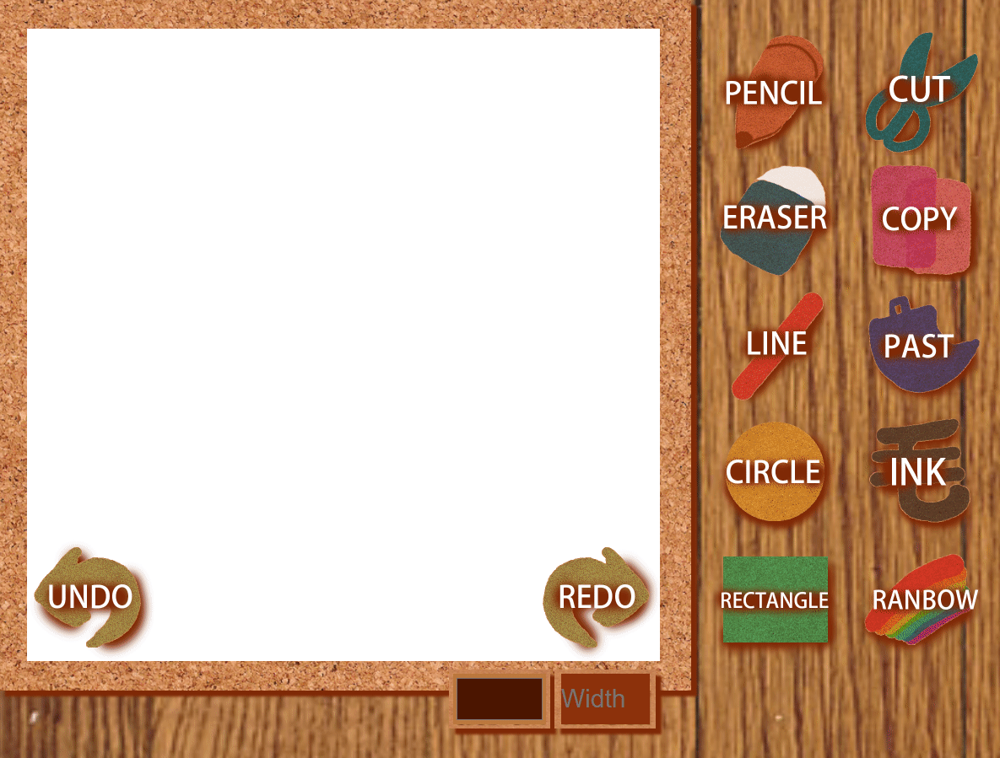

## Web Canvas
</img>

## Report

* The ability of each button

    * Left line :

    1. pen: 在JS裡用3個function控制，
            分別是down(), move(), up();
            來代表按鍵按下去、移動、放開，
            其他畫圖工具原理也是如此。

    ---(other useful ability)----
    2. rainbow: 我利用hsl顏色來讓stroke的時候可以慢慢變色，
                hue++;
                    if (hue >= 360) {
                    hue = 0;
                }
                用以上方法來讓彩虹循環，
                其餘像lineto的方法與pen一樣。
    ------------------------------

    3. rectangle: 正方形的部分我是固定讓他100x100px，
                  用rect的function，
                  而且在move的時候只stroke()，所以只會畫出一個正方形。

    4. circle:  圓形的部分使用的是arc的function，
                固定半徑為50px，move的時候只stroke()，所以只會畫一個圓。

    5. triangle: 三角形使用的是一般的lineto，
                 藉由同時呼叫三次lineto就可以達到固定三角形的效果，
                 move時也只會畫出一個固定的三角形。

    6. eraser:  橡皮擦的話先固定顏色為白色，
                move的原理就和pen一樣，只是不能換顏色，
                且使用完換別的工具會變預設的黑色。

    7. type: 打字的部分比較複雜，我讓方格static在左下角，
             打完字後會出現在我游標的地方，
             共使用了6個不同的function分別控制不同的東西，
             用range來拉fontsize，以及設定了6種字體可以使用。

    * 以上工具預設都是黑色且1px的字體，而且每個工具在canvas上的cursor都是對應的工具圖片。

    
    * Bottom line :
    
    1. color selector: 我增加了8種顏色來選擇，不同工具在使用時，
                       只要點選其中一個顏色就會變色，
                       每個顏色都有一個onclick的funtion。
    
    2. upload:  我在html使用type=file來上傳檔案，
                以及在JS使用一個loadFile的function來上傳圖片。

    * Right line :

    1. undo: 我使用一個function來回到上一步，且每次任何工具按鍵放開的時候進入另一個function用step記憶。

    2. redo: 與undo使用的原理一樣，也是使用一個function來讓undo過後的恢復。

    3. reset: 用location.reload() 這個function就可以清除畫面。

    4. download: 用一個function來下載現在canvas上的圖，且檔名設為your_image.jpg。

    ---(other useful ability)----
    5. facebook: 用圖片蓋住超連結，點下去就會進入facebook。
    -----------------------------

    6. textsize: 各種工具除了text使用的字型都是在這裡控制，且在css使用ul來造成下拉選單的效果，
                 每一種大小對應不同的onclick function，在function裡使用lineWidth控制大小。

* other useful widgets : 

    1. 上述有說明兩種額外的功能，包括rainbow和facebook。

    2. 在css用hover來讓游標移動到每個圖都有往右下1px的控制，讓我們知道現在游標在哪。

    3. 使用jquery來增加前景圖片，點下LET'S START按鈕後才會進入我們canvas的主頁。
    
    
## DEMO

 https://105062333.gitlab.io/AS_01_WebCanvas/
